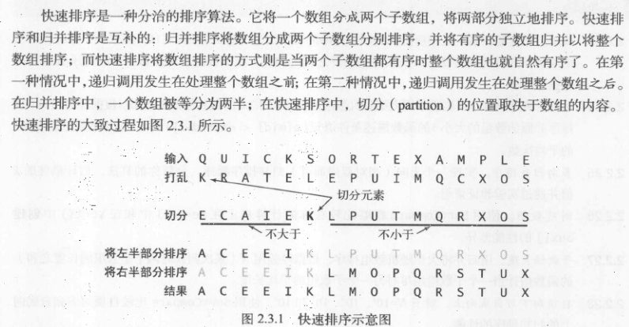
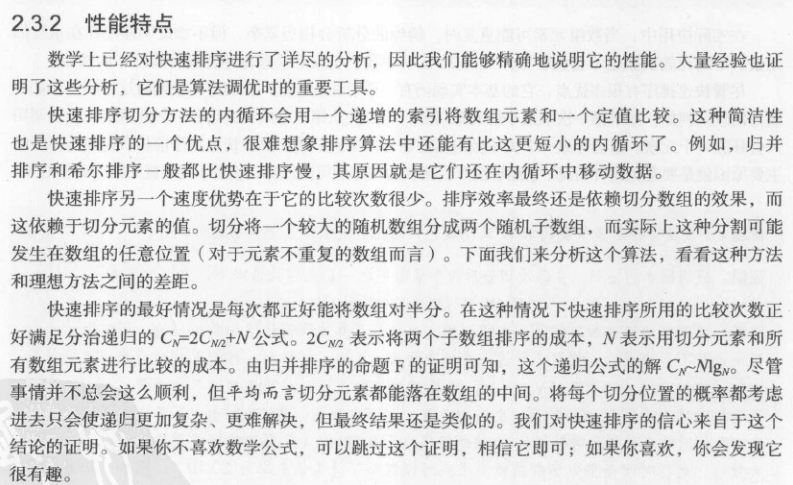

## 简介
**快速排序**（英语：Quicksort），又称划分交换排序（partition-exchange sort），简称快排，一种排序算法，最早由东尼·霍尔提出。在平均状况下，排序 n 个项目要 O(nlog n) 次比较。在最坏状况下则需要 O(n^{2}) 次比较，但这种状况并不常见。事实上，快速排序 (nlog n) 通常明显比其他算法更快，因为它的内部循环（inner loop）可以在大部分的架构上很有效率地达成。

快速排序使用分治法（Divide and conquer）策略来把一个序列（list）分为较小和较大的2个子序列，然后递归地排序两个子序列。



步骤为：

1. 挑选基准值：从数列中挑出一个元素，称为“基准”（pivot），
2. 分割：重新排序数列，所有比基准值小的元素摆放在基准前面，所有比基准值大的元素摆在基准后面（与基准值相等的数可以到任何一边）。在这个分割结束之后，对基准值的排序就已经完成，
3. 递归排序子序列：递归地将小于基准值元素的子序列和大于基准值元素的子序列排序。

递归到最底部的判断条件是数列的大小是零或一，此时该数列显然已经有序。

选取基准值有数种具体方法，此选取方法对排序的时间性能有决定性影响。

资料来源：[维基百科](https://zh.wikipedia.org/wiki/%E5%BF%AB%E9%80%9F%E6%8E%92%E5%BA%8F)



## 测试
```js
node test
```
