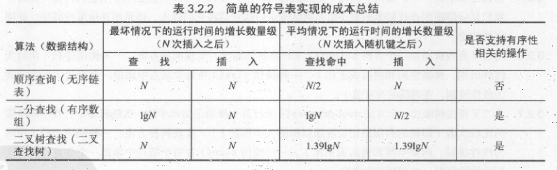
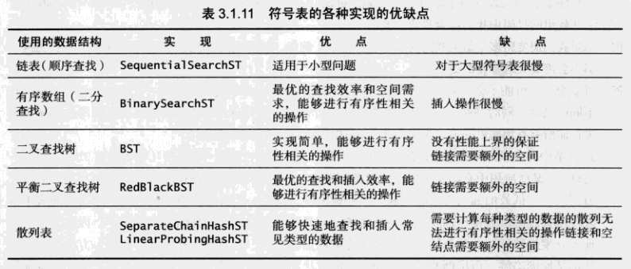

# 查找
## 符号表
符号表可以用链表或数组实现。基于链表的实现是非常低效的，顺序查找平均比较次数为 (n+1)/2 ~ n/2。

## 数据结构
* [二叉查找树](https://github.com/woai3c/Algorithm/tree/master/03/binary-search-tree)
* [红黑树](https://github.com/woai3c/Algorithm/tree/master/03/red-black-tree)
* [散列表](https://github.com/woai3c/Algorithm/tree/master/03/hash-table)

|算法（数据结构）|查找|插入|是否支持有序性相关操作|
|-|-|-|-|
|顺序查询|N|N|否|
|二分查找|log N|N|是|
|二叉查找树|N|N|是|
|红黑树|2log N|2log N|是|
|拉链法|< log N| < log N||
|线性探测法|clog N|clog N||